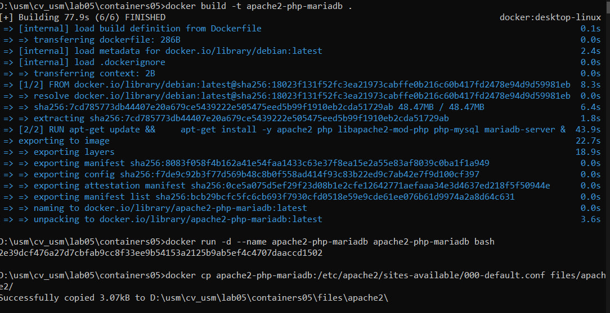
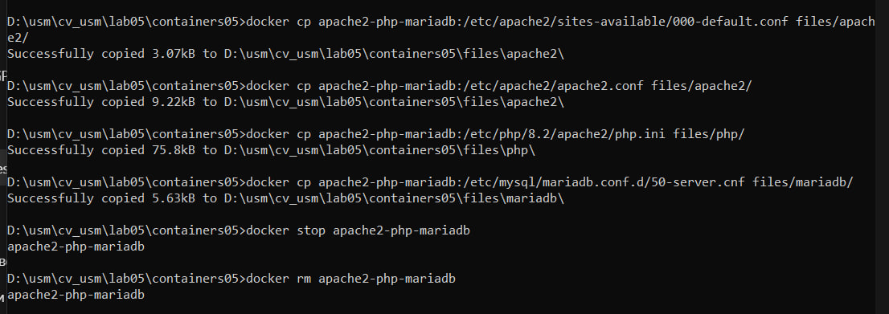
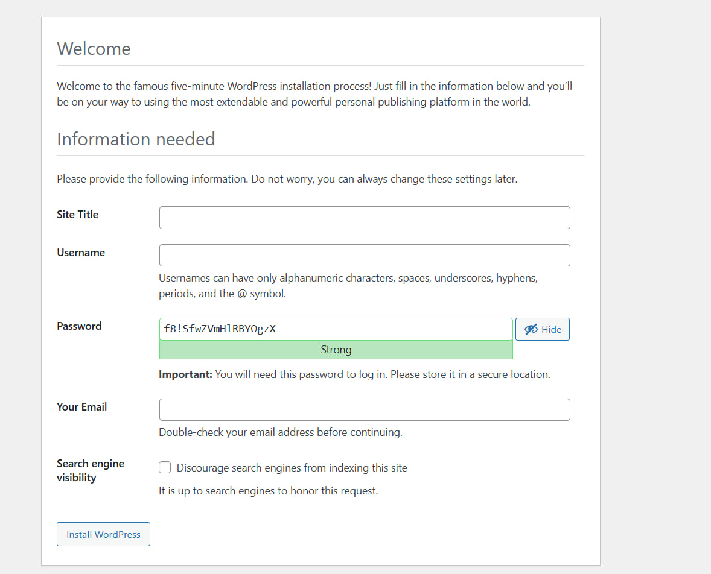

# Лабораторная работа №5: Запуск сайта в контейнере

## Цель работы
Выполнив данную работу, возможно подготовить образ контейнера для запуска веб-сайта на базе Apache HTTP Server + PHP (mod_php) + MariaDB.

## Задание
Создать Dockerfile для сборки образа контейнера, который будет содержать веб-сайт на базе Apache HTTP Server + PHP (mod_php) + MariaDB. База данных MariaDB должна храниться в монтируемом томе. Сервер должен быть доступен по порту 8000.

## Выполнение работы

### 1. Подготовка репозитория
Создали репозиторий `containers05` и склонировали его на компьютер.
Создали в папке `containers05` папку `files` и поддиректории:
- `files/apache2` - для файлов конфигурации Apache2
- `files/php` - для файлов конфигурации PHP
- `files/mariadb` - для файлов конфигурации MariaDB

### 2. Создание Dockerfile
Создали файл `Dockerfile` со следующим содержимым:
```dockerfile
# Используем базовый образ Debian
FROM debian:latest

# Устанавливаем необходимые пакеты
RUN apt-get update && \
    apt-get install -y apache2 php libapache2-mod-php php-mysql mariadb-server && \
    apt-get clean
```

### 3. Построение и запуск контейнера
```sh
docker build -t apache2-php-mariadb .
docker run -d --name apache2-php-mariadb apache2-php-mariadb bash
```


### 4. Извлечение файлов конфигурации
```sh
docker cp apache2-php-mariadb:/etc/apache2/sites-available/000-default.conf files/apache2/
docker cp apache2-php-mariadb:/etc/apache2/apache2.conf files/apache2/
docker cp apache2-php-mariadb:/etc/php/8.2/apache2/php.ini files/php/
docker cp apache2-php-mariadb:/etc/mysql/mariadb.conf.d/50-server.cnf files/mariadb/
```



### 5. Изменение конфигурации
**Apache2:**
- `ServerName localhost`
- `DirectoryIndex index.php index.html`

**PHP:**
- `error_log = /var/log/php_errors.log`
- `memory_limit = 128M`
- `upload_max_filesize = 128M`
- `post_max_size = 128M`
- `max_execution_time = 120`

**MariaDB:**
- Раскомментирована строка `log_error = /var/log/mysql/error.log`

### 6. Добавление Supervisor
Создали файл `files/supervisor/supervisord.conf` с настройками Apache2 и MariaDB.

### 7. Добавление WordPress
```dockerfile
# Добавляем файлы WordPress
ADD https://wordpress.org/latest.tar.gz /var/www/html/
```

### 8. Создание базы данных
```sh
mysql
CREATE DATABASE wordpress;
CREATE USER 'wordpress'@'localhost' IDENTIFIED BY 'wordpress';
GRANT ALL PRIVILEGES ON wordpress.* TO 'wordpress'@'localhost';
FLUSH PRIVILEGES;
EXIT;
```

### 9. Создание `wp-config.php`
Файл `files/wp-config.php` был добавлен в `Dockerfile`.

### 10. Пересборка и тестирование
```sh
docker build -t apache2-php-mariadb .
docker run -d -p 8000:80 apache2-php-mariadb
```



## Ответы на вопросы

1. **Какие файлы конфигурации были изменены?**
   - `000-default.conf`, `apache2.conf`, `php.ini`, `50-server.cnf`, `wp-config.php`

2. **За что отвечает инструкция `DirectoryIndex` в файле конфигурации Apache2?**
   - Определяет файлы, которые сервер будет искать при обращении к каталогу.

3. **Зачем нужен файл `wp-config.php`?**
   - Хранит настройки подключения WordPress к базе данных.

4. **За что отвечает параметр `post_max_size` в файле конфигурации PHP?**
   - Определяет максимальный размер данных, отправляемых методом POST.

5. **Какие недостатки есть в созданном образе контейнера?**
   - Используется устаревшая установка пакетов без фиксации версий.
   - Отсутствует автоматическая настройка базы данных для WordPress.
   - Логирование ошибок можно было бы улучшить.

## Выводы
В ходе выполнения лабораторной работы был создан образ Docker-контейнера с установленным WordPress. Настроены файлы конфигурации и протестирована работоспособность сайта.
